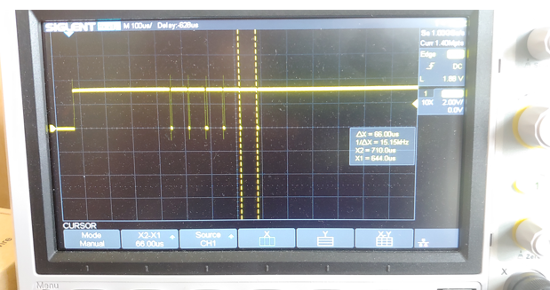

# Table of contents
  1. [Purpose](#purpose)
  2. [Abstract](#abstract)
  3. [Removing write lock](#Write_Lock)
  4. [Write Lock removal code and O-Scope capture](write_lock_code)

## Purpose  :
To develop the code to support reads and write to the AT28C256 EEPROM for use with the 6502 microprocessor the build up components necessary to run code on the 6502.

## Abstract  :
This activity had several chalanges. The AT28256 chip was purchased "new" but like many of the chips purchased, this chip had data on it. while attempting to clear the data it was determined that the chip was also write locked. Since the chip ises 5 volts for both reads and writes, there is a risk of accidental wwrites when the system is power up. If the write enable, output enable, and chip enable pins come up in the "write state", whatever is on the dat lines and address lines will be written to the chip. To prevent this the chip has a write lock capability the prevents accidental writes but either preventing all writes or writs that are not prefixed with a wpecific write code. The write lock can be removed but sending a specific pattern to the chip. there are very specific timing requirements for the unlock process and these will be documented here.

Once the unlock is process is succesfully performed the chip will be programmed with a simple assembly program that will loop and be used to light up a set of LED's with a easily verifiable pattern.

## Removing Write Lock  :

A detailed explaination of the Write lock capability and procedures for setting and clearing the lock can be reviewed [here](https://github.com/rcaspergit/pi_projects/blob/master/docs/datasheets/AT28C256_datasheet.pdf).

The process taken from the data sheet is  for both the lock and the unlock. For unlocking, the pattern consists of 5 write commands. There is an additional complicaation for the lock and unlock. The AT28C256 has a bulk write feature that supports writting 64 bytes of data within in a contigious 64 byte page. this is done by writing up 64 bytes where each byte write happens within 150 microseconds from the previous write.

From the datasheet

"The page write operation of the AT28C256 allows 1 to 64 bytes of data to be written into the device during a single internal programming period. A page write operation is initiated in the same manner as a byte write; the first byte written can then be followed by 1 to 63 additional bytes. Each successive byte must be written within 150 μs (tBLC) of the previous byte. If the tBLC limit is exceeded the AT28C256 will cease accepting data and commence the internal programming operation. All bytes during a page write operation must reside on the same page as defined by the state of the A6 - A14 inputs. For each WE high to low transition during the page write operation, A6 - A14 must be the same. The A0 to A5 inputs are used to specify which bytes within the page are to be written. The bytes may be loaded in any order and may be altered within the same load period. Only bytes which are specified for writing will be written; unnecessary cycling of other bytes within the page does not occur."

The bulk write is used to speed up programming in that upto 64 bytes can be written withing on internal programming cycle which can take 10 miliseconds. The bulk write therfore significantly  reduces the time to program the entire chip.

The wrinkle here is this work will use the Raspberry PI GPIO to set the data, address, and control pins and the associated python code must be able to cycle the "write unlock" sequence with each write pulse with the sequence addresses and data hapening withing the 150 ms bulk write pulse.

## Write Lock Removal Code and O-Scope Capture 

The code was optimized for speed to make the 150 milisecond timing requirementes with all unnecessary calls to functions and looping removed. this makes for somwhat ugly coding but very fast execution. the [code](https://github.com/rcaspergit/pi_projects/blob/master/Memory/AT28C256_EEPROM/AT28C256_unlock.py) sets the address and data patterns and then performs the write sequence in one long thread.

Below is an O-Scope image identifying the write pulse width and timing. The code for clearing the Write lock easiliy made the bulk write paging requirements for the Write Lock removal sequence.

  delta between writes being 66 microseconds, well within the 150 microsecond requirements.
