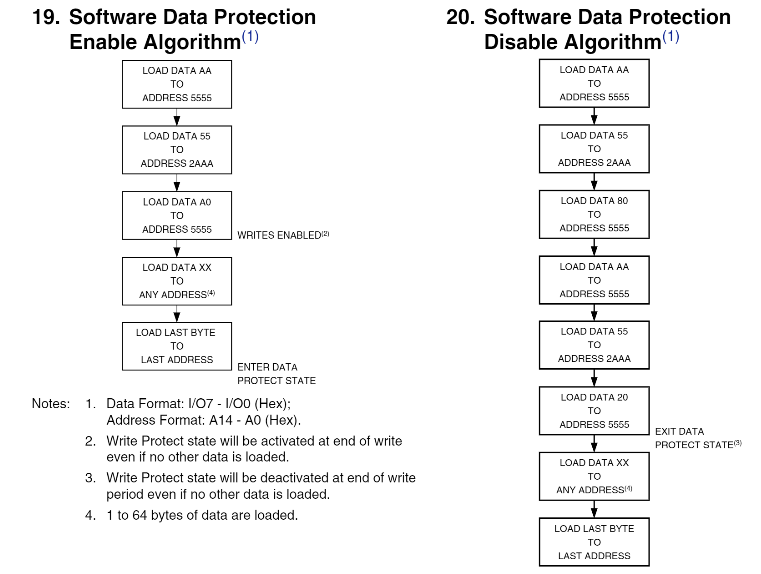

# Table of contents
  1. [Purpose](#purpose)
  2. [Abstract](#abstract)
  3. [Credits](#credits)
  4. [Removing write lock](#Write_Lock)
  5. [Write Lock removal code and O-Scope capture](#write_lock_code)
  6. [Programming the AT28C256 EEProm](#programming_the_chip)
     1. [Clearing the old data](#clear_the_chip)
     2. [Writing the 6502 code](#writing_the_6502_code)

## Purpose <a name="purpose"></a> :
To develop the code to support reads and write to the AT28C256 EEPROM for use with the 6502 microprocessor the build up components necessary to run code on the 6502.

## Abstract <a name="abstract"></a> :
This activity had several chalanges. The AT28256 chip was purchased "new" but like many of the chips purchased, this chip had data on it. While attempting to clear the data it was determined that the chip was also write locked. Since the chip uses 5 volts for both reads and writes, there is a risk of accidental writes when the system is powered up. If the write enable, output enable, and chip enable pins come up in the "write state", whatever is on the data lines and address lines will be written to the chip. To prevent this the chip has a write lock capability the prevents accidental writes by either preventing all writes or writs that are not prefixed with a specific write code. The write lock can be removed by sending a specific pattern to the chip. there are very specific timing requirements for the unlock process and these will be documented here.

Once the unlock is process is succesfully performed the chip will be programmed with a simple assembly program that will loop and be used to light up a set of LED's with a easily verifiable pattern.

## Credits <a name="credits"></a>
The work here follows closely the documentation provided by Ben Eater on his youtube series on clock logic, chip programming, and the 6502. The series can be found by searching on

### Ben Eater
Clock logic - 8-bit computer clock - parts 1-4 for the clock design
How do CPUs read machine code? — 6502 part 1 and 2 for working with the 6502
Assembly language vs. machine code — 6502 part 3 for adding an AT28C256

There are many other videos by Ben Eater for using IC's and building a varity of circuits


## Removing Write Lock <a name="Write_Lock"></a> :

A detailed explaination of the Write lock capability and procedures for setting and clearing the lock can be reviewed [here](https://github.com/rcaspergit/pi_projects/blob/master/docs/datasheets/AT28C256_datasheet.pdf).

The process taken from the data sheet is  for both the lock and the unlock. For unlocking, the pattern consists of 5 write commands. There is an additional complicaation for the lock and unlock. The AT28C256 has a bulk write feature that supports writting 64 bytes of data within in a contigious 64 byte page. this is done by writing up 64 bytes where each byte write happens within 150 microseconds from the previous write.

From the datasheet

"The page write operation of the AT28C256 allows 1 to 64 bytes of data to be written into the device during a single internal programming period. A page write operation is initiated in the same manner as a byte write; the first byte written can then be followed by 1 to 63 additional bytes. Each successive byte must be written within 150 μs (tBLC) of the previous byte. If the tBLC limit is exceeded the AT28C256 will cease accepting data and commence the internal programming operation. All bytes during a page write operation must reside on the same page as defined by the state of the A6 - A14 inputs. For each WE high to low transition during the page write operation, A6 - A14 must be the same. The A0 to A5 inputs are used to specify which bytes within the page are to be written. The bytes may be loaded in any order and may be altered within the same load period. Only bytes which are specified for writing will be written; unnecessary cycling of other bytes within the page does not occur."

The bulk write is used to speed up programming in that upto 64 bytes can be written withing on internal programming cycle which can take 10 miliseconds. The bulk write therfore significantly  reduces the time to program the entire chip.

The wrinkle here is this work will use the Raspberry PI GPIO to set the data, address, and control pins and the associated python code must be able to cycle the "write unlock" sequence with each write pulse with the sequence addresses and data hapening withing the 150 ms bulk write pulse.

## Write Lock Removal Code and O-Scope Capture <a name="write_lock_code"></a>

The code was optimized for speed to make the 150 milisecond timing requirementes with all unnecessary calls to functions and looping removed. this makes for somwhat ugly coding but very fast execution. The [code](../../Memory/AT28C256_EEPROM/AT28C256_unlock.py) sets the address and data patterns and then performs the write sequence in one long thread. A small excerpt of the parrern setting routing and the main loop is given below:
```
def set_addr_5s():
    GPIO.output(23,1)
    GPIO.output(22,0)
    GPIO.output(21,1)
    GPIO.output(19,0)
    GPIO.output(18,1)
    GPIO.output(16,0)
    GPIO.output(15,1)
    GPIO.output(13,0)
    GPIO.output(12,1)
    GPIO.output(11,0)
    GPIO.output(10,1)
    GPIO.output(8,0)
    GPIO.output(29,1)
    GPIO.output(5,0)
    GPIO.output(3,1)
```

The above code block sets the addresses for 5555. Then
```
def set_data_AA():
    GPIO.output(40,1)
    GPIO.output(38,0)
    GPIO.output(37,1)
    GPIO.output(36,0)
    GPIO.output(35,1)
    GPIO.output(33,0)
    GPIO.output(32,1)
    GPIO.output(31,0)
```
Sets the data bits for AA. The other address and data patterns are similarly set. Finally, the main loop code block for the first pattern address 5555 getting AA is shown below:
```
set_addr_5s()
set_data_AA()
dummy=dummy*5
GPIO.output(write_enable,0)
dummy=dummy*5
GPIO.output(write_enable,1)
```
where dummy=dummy*5 is code to add some time to the section to tweek the timing to lan with deltas around 60 microseconds.

Below is an O-Scope image identifying the write pulse width and timing. The code for clearing the Write lock easiliy made the bulk write paging requirements for the Write Lock removal sequence.

  delta between writes being 66 microseconds, well within the 150 microsecond requirements. The actual write pulses are on the order of 5 microseconds.

## Programming the AT28C256 EEProm <a name="programming_the_chip"></a>

### Clearing the old data <a name="clear_the_chip"></a>

Once the write_lock was removed it was time to clear the EEProm. The code for this was fairly straight forward.
```
import RPi.GPIO as GPIO            # import RPi.GPIO module
from time import sleep             # lets us have a delay
GPIO.setmode(GPIO.BOARD)             # choose BCM or BOARD
import pdb


address_pins = [3,5,29,8,10,11,12,13,15,16,18,19,21,22,23]

write_enable = 24
output_enable = 26
#chip_enable = 29

data_pins = [31,32,33,35,36,37,38,40]


GPIO.setup(write_enable,GPIO.OUT,initial=1)
GPIO.setup(output_enable,GPIO.OUT, initial=1)
#GPIO.setup(chip_enable,GPIO.OUT, initial=0)


def set_data(outbyte):
    for i in range(len(data_pins)):
        GPIO.output(data_pins[i],0)
    return

for y in  range(len(address_pins)):
    GPIO.setup(address_pins[y], GPIO.OUT, initial=0)

for y in range(len(data_pins)):
    GPIO.setup(data_pins[y], GPIO.OUT, initial=0)

try:
     for x in range(0x8000):
        for y in range(len(address_pins)):
            GPIO.output(address_pins[y],((x>>y)&1))
        set_data(0x00)
        sleep(.0001)
        GPIO.output(write_enable,0)
        sleep(.00001)
        GPIO.output(write_enable,1)
        sleep(.012)

except:          # trap a CTRL+C keyboard interrupt
    GPIO.cleanup()

GPIO.cleanup()

```
The top half of the code is used to callout the control chips and set up the GPIO address and data pins. Since we will be writting, the address and data pins will be output. The AT28C256 has a write verify process to ensure the writes completes successfully that will be using the the programming section but to clear the chip, some sleeps were injected to ensure the write pins stayed active, and the delta between writes were inline with the chip specifications.

The code runs through all the addresses, sets the data to "00" , sleeps for 1/10 th of a microsecond to let the data and address bits stabalize, and then toggles the write enable for 10 microseconds. After the write pulse, a sleep for 12 miliseconds is inserted to allow the chip to process the internal write which the spec calls for a minimum of 10 miliseconds.

The bulk page write feature could have been used but we not necessary since the write time was just a few minutes.

### Writing the 6502 code <a name="writing_the_6502_code"></a>

In the 6502 section and docs section of this repo, the datasheet specifying the machine code for the 6502 chip is given. For this work, a very simple program was needed that would light up the 8 data registers in a specific patter to verify operation. the code was then set up to loop for ever.

Setting up the EEPROM to work with the 6502 required 2 steps. THe first step is setting up a jump location at address #fffd and #fffe. When the 6502 resets, it tries to access memory at location #fffe and #fffe to get the starting location of its program. For this work, the location in little endian format was #8000. The high order bit is ignored coming out of the 6502 since the AT28C256 only has 15 bits of address space but can be used for chip select if multiple Memory chips, Ram, Rom, ... are used. More on this later.

The second part of the programming is the code itself. Since the high order bit of the 6502 jump location is ignored, the code will be read from the AT28C256 starting at location zero. The machine code for the assembly below will start at location zero

```
loop:
   lda #$81
   sta $6000
   lda #$42
   sta $6000
   lda #$24
   sta $6000
   lda #$18
   sta $6000
   jmp loop
```

if the LED's are tied to the data bits the code above can be seen to light the outermost LED's (0, and 7), then the next outermost (1, and 6), then the next (2. and 5) etc... at each step, the code sets the address to $6000 which is not used and is a dummy address and sets the data bits to to the desired LED pattern.

Now for the intresting part. If the EEPROM chip is not disabled when the write to $6000 occures, the AT28C256 will see the address lines for $6000 set and will output the data at that locatio nwhich is all zeros and the LED's will never operate.

To get around this many chips are "tri-state" meaning if the chip enable pin is high, the output pins will be in a high impedence state, i.e. will appear to be removed for the circuit. So when the store $6000 occures, the chip enable for the AT28C256 chip has to be brought high. This is easy to accomplish by tying the 14th bit of the 6502 address bus to the chip enable pin of the AT28C256 Chip enable pin. Now, when the 6502 puts $6000 in the address bus the AT28C256 chip will be disabled and in a high impedance state, so the data written out of the 6502, namily the LED pattern will appear on the data bus and light the LED's

Below is the harness used to program the AT28C256_EEPROM

The Raspberry Pi is managing the address, data, and control pins. The LED's are tapping the data lines and the control pins WE (Write enable), CE (Chip Enable), and OE (Output Enable). These are used to visually verify the data and control pin values for testing.

The code to program the AT28C256
```
import RPi.GPIO as GPIO            # import RPi.GPIO module
from time import sleep             # lets us have a delay
GPIO.setmode(GPIO.BOARD)             # choose BCM or BOARD
import pdb


address_pins = [3,5,29,8,10,11,12,13,15,16,18,19,21,22,23]
# address_pins = [23,22,21,19,18,16,15,13,,12,11,10,8,29,5,3]

write_enable = 24
output_enable = 26
#chip_enable = 29

data_pins = [31,32,33,35,36,37,38,40]
# data_pins = [31,32,33,35,36,37,38,40]

low_bytes = [   0xa9, 0x81, 0x8d, 0x00, 0x60,
                0xa9, 0x42, 0x8d, 0x00, 0x60,
                0xa9, 0x24, 0x8d, 0x00, 0x60,
                0xa9, 0x18, 0x8d, 0x00, 0x60,
                0x4c, 0x00, 0x00]


high_bytes = [0x00,0x00]
high_byte_addresses = [0x7ffc,0x7ffd]

GPIO.setup(write_enable,GPIO.OUT,initial=1)
GPIO.setup(output_enable,GPIO.OUT, initial=1)
#GPIO.setup(chip_enable,GPIO.OUT, initial=0)

def pole_completion(address,data_byte):

    GPIO.output(write_enable,1)
    GPIO.output(output_enable,0)

    for y in range(len(address_pins)):
       GPIO.output(address_pins[y],((address>>y)&1))

    read_byte = 0;
    for i in range(8):
        read_byte = read_byte | (GPIO.input(data_pins[i]) << i)
    return(read_byte == data_byte)

def set_data(outbyte):
#    print("outbyte = " + hex(outbyte))
    for i in range(len(data_pins)):
        GPIO.output(data_pins[i],(outbyte>>i)&1)
    return

for y in  range(len(address_pins)):
    GPIO.setup(address_pins[y], GPIO.OUT, initial=0)

for y in range(len(data_pins)):
    GPIO.setup(data_pins[y], GPIO.OUT, initial=0)

try:
     for x in range(len(low_bytes)):
        for y in range(len(address_pins)):
            GPIO.output(address_pins[y],((x>>y)&1))
        set_data(low_bytes[x])
        sleep(.001)
        GPIO.output(output_enable,1)
        GPIO.output(write_enable,0)
        sleep(.001)
        GPIO.output(write_enable,1)
        while(pole_completion(x,low_bytes[x]) != True):
            sleep(.001)

     for x in range(len(high_bytes)):
        for y in range(len(address_pins)):
            GPIO.output(address_pins[y],((high_byte_addresses[x]>>y)&1))
        set_data(high_bytes[x])
        sleep(.001)
        GPIO.output(output_enable,1)
        GPIO.output(write_enable,0)
        sleep(.01)
        GPIO.output(write_enable,1)
        while(pole_completion(high_byte_addresses[x],high_bytes[x]) != True):
            sleep(.001)


except KeyboardInterrupt:          # trap a CTRL+C keyboard interrupt
    GPIO.cleanup()

GPIO.cleanup()
```

Setting up the GPIO pins and setting up the addresses and data for the writes is pretty straight forward. There are a couple of features of the code above to be called out. The first is the data array corresponding to the machine code for the assembly code described earlier.
```
low_bytes = [   0xa9, 0x81, 0x8d, 0x00, 0x60,
                0xa9, 0x42, 0x8d, 0x00, 0x60,
                0xa9, 0x24, 0x8d, 0x00, 0x60,
                0xa9, 0x18, 0x8d, 0x00, 0x60,
                0x4c, 0x00, 0x00]
```
The machine code was hand coded using the 6502 datasheet with addressing in little endian format. For example 0xa9 is the machine code for the load A instruction.

The second part of the code to point out is the data. Its broken into two seperate arrays, the first is the machine code and the second it to write the jmp address to locations #fffd and #fffe

The third chunk of code to call out is the write verifiation code. In the clear code above, the writes were just spaced far enough appart to allow for the internal write to take place, about 10 miliseconds. For this code, a specific verify routine was written. According to the datasheet, after a write starts, a check should be made between the data location and the desired value. The code for this is

```
def pole_completion(address,data_byte):

    GPIO.output(write_enable,1)
    GPIO.output(output_enable,0)

    for y in range(len(address_pins)):
       GPIO.output(address_pins[y],((address>>y)&1))

    read_byte = 0;
    for i in range(8):
        read_byte = read_byte | (GPIO.input(data_pins[i]) << i)
    return(read_byte == data_byte)
```

The control pins are set up for reading and the data byte at the specified address is compared to the desired data byte. This routine returns a boolean TRUE is the read byte is the data byte.

The main loop the uses the pole_completion routine to sleep the follow on writes.
```
for x in range(len(high_bytes)):
   for y in range(len(address_pins)):
       GPIO.output(address_pins[y],((high_byte_addresses[x]>>y)&1))
   set_data(high_bytes[x])
   sleep(.001)
   GPIO.output(output_enable,1)
   GPIO.output(write_enable,0)
   sleep(.01)
   GPIO.output(write_enable,1)
   while(pole_completion(high_byte_addresses[x],high_bytes[x]) != True):
       sleep(.001)
```
